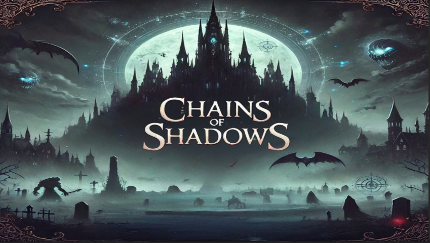
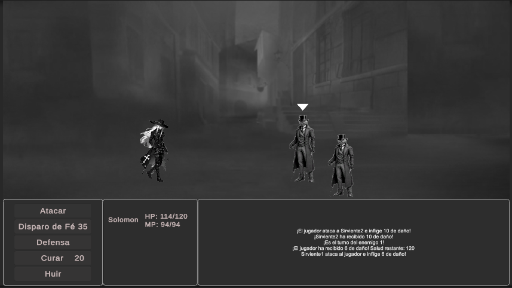
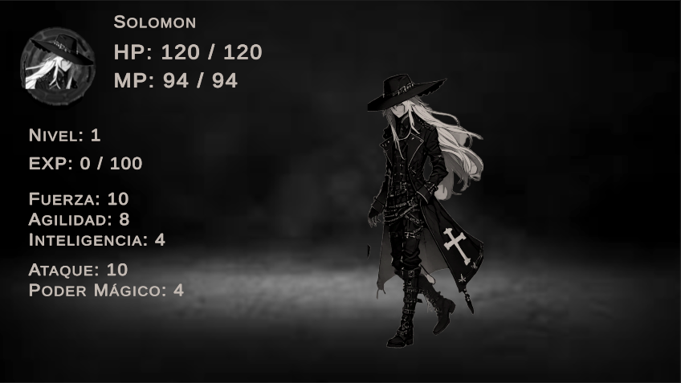
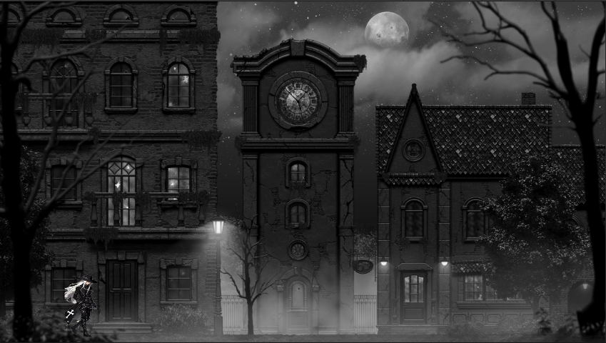
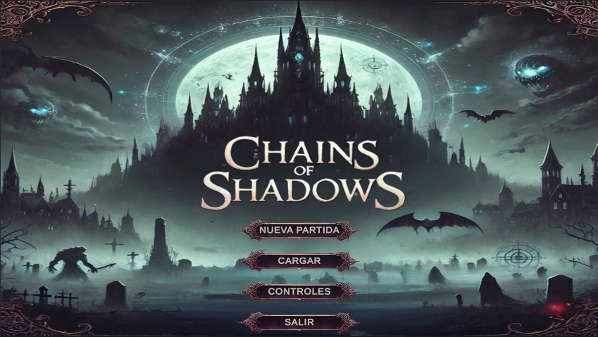
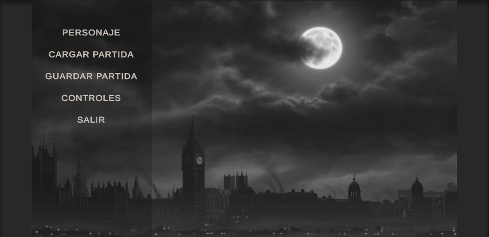
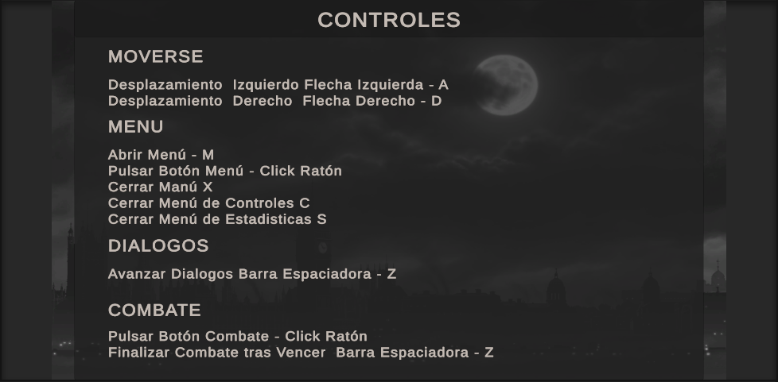
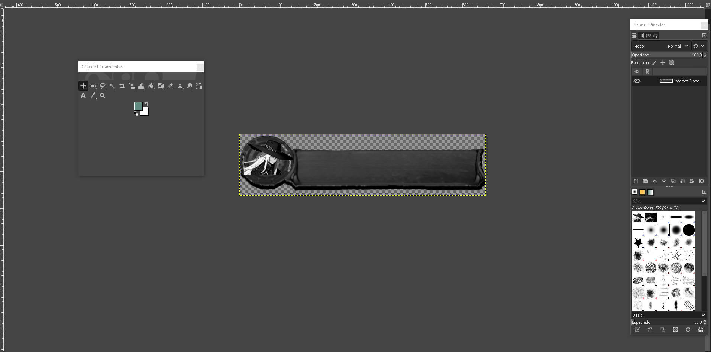
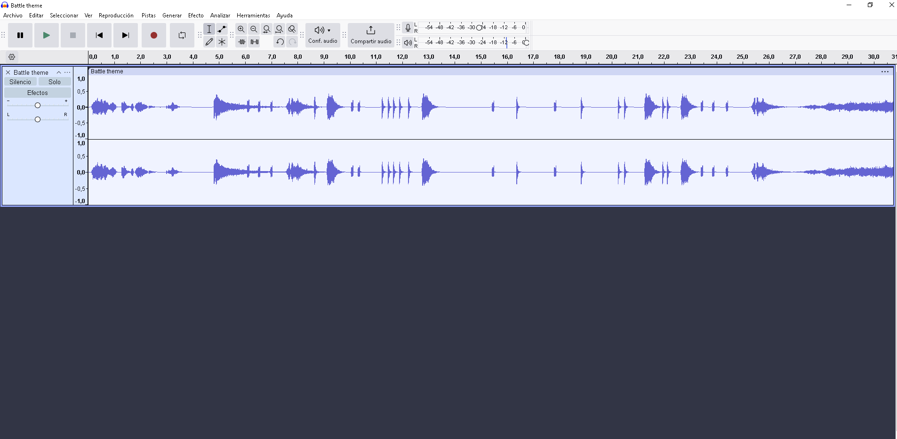
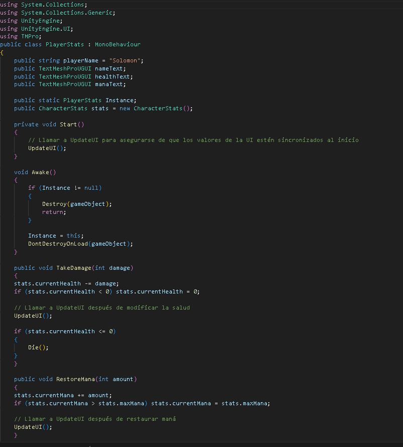

---

# Índice

1. [Introducción](#introducción)
2. [Historia y Narrativa](#historia-y-narrativa)
3. [Mecánicas del Juego](#mecánicas-del-juego)
4. [Jugabilidad y Progresión](#jugabilidad-y-progresión)
5. [Estilo Visual](#arte-y-estilo-visual)
6. [Música y Sonido](#música-y-sonido)
7. [Enemigos](#Enemigos)
7. [Interfaz y Experiencia de Usuario (UI/UX)](#interfaz-y-experiencia-de-usuario-uix)
8. [Aspectos Técnicos](#aspectos-técnicos)
9. [Monetización y Modelo de Marketing](#monetización-y-modelo-de-marketing)
10. [Plan de Desarrollo](#plan-de-desarrollo)
11. [Notas Adicionales](#notas-adicionales)

---

## Introducción
Chains of Shadows es un Juego de género rpg con tintes de terror y suspense ambientado en la época victoriana, con una tématica tétrica oscura y macabra

## Historia y Narrativa
Año 1841, en la ciudad Duskmoor se han registrado desapariciones masivas de población compuesta por mendigos, indigentes  y jóvenes callejero...

Durante este tiempo las autoridades locales se han negado a investigar estos extraños sucesos.

Debido a los extensos rumores relacionados con estos hechos, el vaticano decidió tomar cartas en el asunto enviando a Solomon, un experimentado exorcista de un pasado oscuro y especializado en confrontar a entidades malignas, lidiar con eventos paranormales y investigar casos extraños.

Su llegada a Duskmoor, acompañada en un inicio de un pensamiento excéptico con respecto a la naturaleza de este caso pese a buscar su búsqueda de la verdad detrás de las desapareciones, para más adelante descubrir que está totalmente equivocado....

## Mecánicas del Juego
Este juego consiste en avanzar a lo largo de los diferentes mapas, a medida que vas progresando en la historia del juego hasta descubrir la verdad detrás de las desapariciones y detener al responsable.

A medida que caminas tienes una probabilidad de entrar en combate y encontrarte diferentes tipos de enemigos. También a lo largo del juego te encontrarás obligatoriamente enemigos mucho más poderosos te obligarán a derrotarlos antes de darte acceso a una zona nueva o avanzar en la trama.

En cuanto a combate tiene mécanicas que aplican el sistema por turnos, en el cúal puedes realizar una variedad de acciones o habilidades durante tu turno antes de pasarselo a tus enemigos que tambien harán lo mismo, hasta que uno de los dos muera o en caso de tratarse de enemigos comunes, al lograr huír.

  

Las acciones básicas serían:

- <ins>Atacar</ins>: Realizas un ataque básico al enemigo, sin coste alguno, escala con la fuerza.

- <ins>Disparo de Fé</ins>: Canalizas el poder sagrado para bendecir las balas de tu arma y realizar un potente ataque disparando a tu enemigo. Este ataque consume Maná (MP) y escala con la estadística de inteligencia, con lo cúal hay que aprovechar al máximo sus limitados usos.

- <ins>Defensa</ins>: Adoptas un estado defensivo que te permite mitigar a la mitad el daño entrante de los enemigos en el próximo turno. Suele ser especialmente útil en jefes o cuando solo te enfrentas a un enemigo.

- <ins>Curar</ins>: Utilizas poder sagrado para sanar tus heridas, lo cúal te restaura puntos de vida en combate (HP) y escala con la estadística de inteligencia.

- <ins>Huir</ins>: Intentas huír del combate contra enemigos comunes. Tienes un porcentaje de lograrlo, que se irá incrementando con la estadística de agilidad. En caso de fallar el intento de huída serás expuesto a un ataque del enemigo.

## Jugabilidad y Progresión

  

El juego utiliza un sistema básico de niveles que te permitirán ir haciendote más poderoso a medida que vas matando enemigos y vas obteniendo experiencia de estos para aumentar tu nivel y tus estadisticas irán escalando progresivamente. 

Además de eso, subir un nivel o cambiar de mapa, te permitirá recuperar completamente tus HP/MP. La recuperación completa por subida de nivel puede llegar a aplicarse incluso dentro de combate si cuando matas a un enemigo te otorga suficiente experiencia para subir de nivel, aunque el combate prosiga en caso de haber más de un enemigo.

## Estilo Visual
En cuanto a ambientacíon, intenta abarcar una estética gótica y con un toque victoriano. El uso de una paleta de colores en blanco, negro y tonos grises busca crear un ambiente oscuro y melancólico, evocando sensaciones de misterio y decadencia. La ausencia de colores vivos refuerza el tono lúgubre y opresivo del escenario.

  

## Música y Sonido
La música en conjunto la estética del juego busca crear un ambiente atrapante, de misterio y a la vez apresivo. Los diálogos emplean música única para crear determinadas sensaciones dependiendo del contexto dentro de esta, que van desde la tensión, suspense hasta emotividad.

Los combates con enemigos comunes tienen el mismo soundtrack, que busca generar la sensación tensión a la vez que dinámismo durante el combate. Los enemigos más poderosos (Boss) tienen una banda sonora única que busca darles identidad y reflejar un poco su naturaleza de fondo, a la vez que tratan de mantener al jugador en tensión y de forma atrapante.

Los ataques comunes de los enemigos y personaje tienen un sonido en común, los ataques especiales o característicos de ciertos de los enemigos o boss, tienen su propio efecto particular. 

Las habilidades de Disparo de Fé y Curar que son las habilidades características del personaje principal también poseen su propio sonido.

## Enemigos
Este juego tiene varios tipos de enemigos, dos de ellos básicos, uno de ellos en su versión potenciada de jefe y dos jefes. Cada enemigo tiene sus propio comportamiento y patrones de daño, así como mecánicas propias y únicas que obligaran al jugador a adaptarse a ellos. Los jefes además de nás mecánicas y variedad de ataques, tienen mecánicas que se activan por porcentaje de vida, lo cúal en otro juego sería como un faseo, a partir del cúal su patrón de movimientos cambia o emplea movimientos únicos, intentando generar desconcierto en el jugador y a la vez que una mayor dificultad y satisfacción al ser derrotados.

---------------------------Shadow---------------------
Seres incorpíreos creados con las almas de las victimas

-------------------------Sirviente---------------------
Extraños individuos que secuestran indigentes

---------------------------Viktor-----------------------
Misterioso noble adinerado obsesionado con su madre 

## Interfaz y Experiencia de Usuario (UI/UX)
Es juego tiene un menú inicial que permite iniciar nueva partida, cargar partida, controles y salir del juego.

Dentro del juego tienes un menú similar pero con la opción de guardar.

El juego tendría los siguientes controles.

## Aspectos Técnicos
Este Juego para plataformas de PC, en idioma Español.Es en resolución Full HD (1929x1080).

## Monetización y Plan de Marketing
En cuanto a monetización, el juego tendría un precio módico de 1,99 euros. La idea es intenta ser accesible a un público de nicho que pueda fidelizarse al producto. 

El plan de marketing consistiría básicamente en:

-<ins>Promocionar a través de redes sociales personales</ins>.

-<ins>Crear una cuenta oficial y ir publicando avances o noticias de proyecto para crear expectativas y solicitar feedback a través de encuestas para crear un trato cercano y bilateral de cara al público</ins>

-<ins>Realizar un trailer promocional del juego</ins>.

-<ins>Publicidad mediante gameplays de streamers facilitando versiones de prueba gratuitas a estos para mayor difusión</ins>.

## Plan de Desarrollo
El plan de desarrollo fue de 40 horas de desarrollo en Unity, 5 horas de correccíons de bugs y otras 50 horas dedicadas a desarrollo conceptual, edición de soundtrack y trabajo de apartado gráfico. 

## Notas Adicionales
Algunos sprites han sido desarrollados con ia, otros gratis o modificados manualmente mediante edición de imagen con Gimp. Se ha utilizado música gratuita que ha sido modificada manualmente mediante Audacity.

En cuanto a programación este juego se basa en intentar implementar un sistema de faseo entre escenas para entrar, salir del combate, cambiar de mapa guardando la posición anterior del jugador y la escena si no el faseo no es a un combate para que en caso de serlo pueda volver a su posición anterior tras ganar el combate o prefijar una posición exacta de aparición del personaje entre cambios de mapas o dialogos. 

Tambíen se intenta en todo momento que la vida, mana, las estadísticas de personaje y nivel se conserven entre transiciones o se recalculen constantemente entre cambios de escena.También se intenta evitar múltiples problemas que surgieron con los duplicados de objetos que pueden surgir entre cambios de escena dando lugar a bugs.

